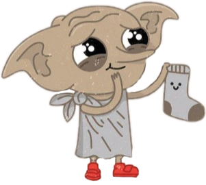

#  socks
## Secure Open Cluster microKernel OS

(c) Dmitry Ponyatov <<dponyatov@gmail.com>> 2022 All rights reserved

github: https://github.com/ponyatov/socks/

<a href="rust/socks/index.html">rustdoc</a>

* Rust microkernel
    * @ref i386 (QEMU-i386)
    * @ref guest
* Erlang reworked runtime

powered with [metaL](https://github.com/ponyatov/metaLgen)
